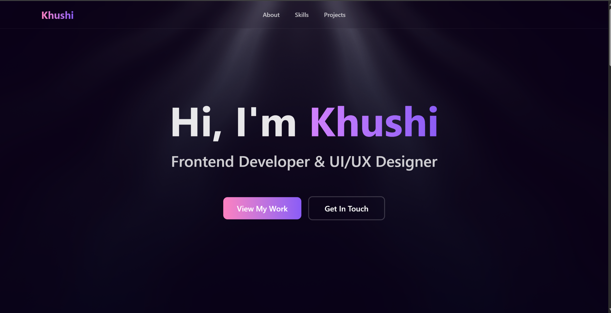

#  Khushi Mishra - Frontend Developer Portfolio

A modern, responsive portfolio website showcasing my journey as a frontend developer and UI/UX designer. Built with React, Tailwind CSS, and Framer Motion to deliver a smooth, visually appealing user experience.

 

##  Features

- **Modern Design**: Clean and elegant UI with gradient accents
- **Smooth Animations**: Powered by Framer Motion for fluid transitions
- **Fully Responsive**: Optimized for desktop, tablet, and mobile devices
- **Fast Performance**: Built with Vite for lightning-fast load times
- **Project Showcase**: Displays featured projects with tech stacks and live demos
- **Skills Section**: Interactive display of technical skills and tools
- **Contact Form**: Easy ways to get in touch via email and social links

## Tech Stack

| Category | Technologies |
|----------|-------------|
| **Frontend** | React.js, JavaScript (ES6+) |
| **Styling** | Tailwind CSS |
| **Animation** | Framer Motion |
| **Icons** | React Icons |
| **Build Tool** | Vite |
| **Deployment** | Vercel |

##  Installation

### Prerequisites

Before you begin, ensure you have the following installed:
- **Node.js** (v16 or higher)
- **npm** or **yarn**

### Steps

Follow these steps to run the project locally:

```bash
# 1️⃣ Clone the repository
git clone https://github.com/Khushi256/crust.git

# 2️⃣ Move into the project folder
cd portfolio

# 3️⃣ Install dependencies
npm install

# 4️⃣ Run the development server
npm run dev
```

## Sections

### Hero Section
- Eye-catching introduction with animated light rays
- Call-to-action buttons

### About Me
- Personal introduction
- Professional background
- Career goals

### Skills
- **Languages**: C++, JavaScript, TypeScript, Python, C
- **Frontend**: React, Redux, Framer Motion, HTML5, CSS3, Tailwind CSS
- **Tools**: Git, GitHub, Figma, Postman, Vercel

### Projects
Featured projects include:
- **ResumeBot**: AI-powered resume generator using Gemini API
- **Crust**: Modern pizzeria landing page with smooth animations
- **Craft**: Creative web application with advanced React patterns

### Contact
- Direct email link
- Social media connections (GitHub, LinkedIn, Twitter)
- Location information

##  Deployment

This portfolio is deployed on [Vercel](https://portfolio-khushi-mishra.vercel.app/). 

##  License

This project is open source and available under the [MIT License](LICENSE).

## Author

**Khushi Mishra**
- LinkedIn: [Khushi Mishra](https://linkedin.com/in/khushi-mishra-06815931b)

---

